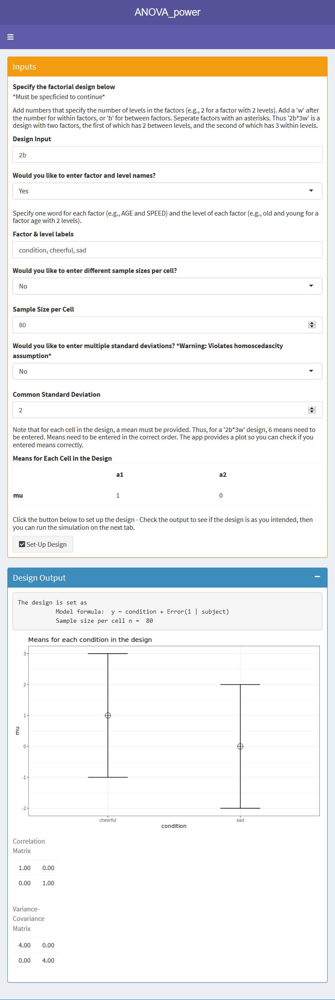
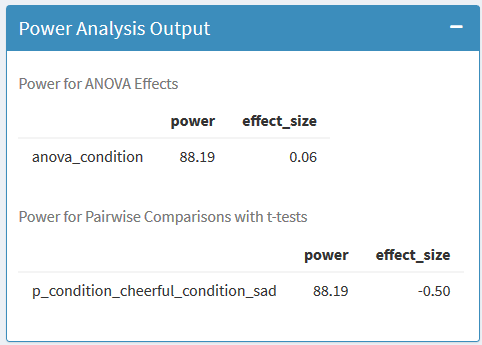

```{r load_packages, include=FALSE}
#devtools::install_github("arcaldwell49/Superpower")
library(Superpower)
library(ggplot2)
library(dplyr)
library(knitr)
library(kableExtra)
library(gridExtra)
library(MASS)
library(reshape2)
library(afex)

#Set to low number when test-compiling, set to 100.000 for final manuscript.
nsims <- 100000

#Set manuscript seed

manuscript_seed = 2019
Superpower_options(plot = FALSE, verbose = FALSE)
```

When a researcher aims to test hypotheses with an analysis of variance (ANOVA) the sample size of the study should be justified based on the statistical power of the test. 
The statistical power of a test is the probability of rejecting the null-hypothesis, given a specified effect size, alpha level, and sample size. 
When the statistical power of a test is low, there is a high probability of a type 2 error, or concluding there is no effect when a true effect exists in the population of interest.

Several excellent resources exist that explain power analyses, including books [@aberson_applied_2019; @cohen_statistical_1988], general reviews [@maxwell_sample_2008], and practical primers [@brysbaert_how_2019; @perugini_practical_2018]. 
Whereas power analyses for individual comparisons are relatively easy to perform, power analyses for factorial ANOVA designs are a bigger challenge. 
There is a range of power analysis software available such as G\*Power [@faul_gpower_2007], MorePower [@Campbell2012MorePower6F], PANGEA [@westfall2015pangea], pwr2ppl [@aberson_applied_2019], APRIOT [@lang2017intermediately], PASS, and SAS.
These tools differ in their focus (e.g., sequential analyses for APRIOT, linear mixed models for PANGEA), the tests they provide power analyses for (e.g., allowing violations of the homogeneity assumption, unequal sample sizes, and power analysis for ANCOVA designs), and the input they require (e.g., effect sizes, raw data, or means, standard deviations, correlations, and sample sizes).^[For a detailed overview of the functionality of different software packages, see https://osf.io/9mzpn/.]
Despite this wide range of software options, in our experience researchers often struggle to perform power analyses for ANOVA designs.

In this manuscript we introduce the Superpower R package and accompanying Shiny apps that can be used to perform power analyses for factorial ANOVA designs based on simulations.
We designed Superpower with the goal to be free, available both as R functions and an online app, and to easily allow researchers to perform power analyses for a wide range of ANOVA designs.
Compared to G\*power, the pwr R package, and the pwr2ppl R package, Superpower can compute power for a wider range of designs (e.g., up to 3 factors with 999 levels).
Compared to PANGEA, G\*power, and MorePower, we believe the required input is somewhat more intuitive, as users enter means, standard deviations, and  correlations, instead of effect sizes and variance components. 
A unique feature of Superpower is that it allows users to easily correct for multiple comparisons in exploratory ANOVA designs, and that it automatically provides the statistical power for all main effects, interactions, and simple comparisons for a specified ANOVA design.
The online manual at http://arcaldwell49.github.io/SuperpowerBook provides detailed examples for power analyses (ranging from One-Way ANOVA designs to three-way interactions for mixed designs, MANOVA analyses, and power analyses for when ANOVA assumptions are violated), as well as examples validating power analyses in Superpower against existing software.
A current limitation of Superpower is that it cannot compute power for ANCOVAs or linear mixed models.

Superpower allows researchers to perform simulation-based power analyses without having extensive programming knowledge.
By simulating data for factorial designs with specific parameters, researchers can gain a better understanding of the factors that determine the statistical power of an ANOVA, and learn how to design well-powered experiments.
After a short introduction to statistical power, focusing on the *F*-test, we will illustrate through simulations how the power of factorial ANOVA designs depends on the pattern of means across conditions, the number of factors and levels, the sample size, and whether you need to control the alpha level for multiple comparisons.

# A basic example

Imagine you perform a study in which participants interact with an artificial voice assistant who sounds either cheerful or sad.
You measure how much 80 participants in each condition enjoy interacting with the voice assistant on a line marking scale (coded continuously from -5 to 5).
You observe a mean of 0 in the sad condition, and a mean of 1 in the cheerful condition, with an estimated standard deviation of 2. 
After submitting your manuscript for publication, reviewers ask you to add a study with a neutral control condition to examine whether cheerful voices increase, or sad voices decrease enjoyment (or both).
Depending on what the mean enjoyment in the neutral condition in the population is, what sample size would you need to collect for a high powered test of the expected pattern of means? 
A collaborator suggests to switch from a between-subject design to a within-subject design to collect data more efficiently.
What impact will switching to a within-subject design have on the required sample size?
The effect size observed in the first study is sometimes referred to as a 'medium' effect size based on the benchmarks by @cohen_statistical_1988. 
Does it make sense to perform an a-priori power analysis for a 'medium' effect size if we add a third between-subject condition, or switch to a within-subject ANOVA design?
And if you justify the sample size based on the power for the main effect for the ANOVA, will the study also have sufficient statistical power for the independent comparisons between conditions (or vice versa)?
Before we answer these questions, let's review some of the basic concepts of statistical power, and examine how power calculations are typically performed.

# Calculating Power for ANOVA Designs

Let's consider the two condition design described earlier, where enjoyment is measured when 80 participants per condition interact with a cheerful or sad voice assistant.
We can test the difference between two means with a *t*-test or a one-way ANOVA, and the two tests are mathematically equivalent. 
Figure \ref{fig:d-plot} and Figure \ref{fig:eta-plot} visualize the distribution of the effect sizes Cohen's d (for the *t*-test) and $\eta_p^2$ (for the *F*-test) that should be observed when there is no effect (grey curves) and when the observed difference between means equals the true effect (black curves)^[We refer to sample level statistics (indicated with a hat) by default, and mention when we refer to population parameters instead.].
In both figures the light grey areas under the null-distribution mark the observed effect sizes that would lead to a Type 1 error (observing a statistically significant result if the null-hypothesis is true) and the dark grey areas under the curve mark the observed effect sizes that would lead to a Type 2 error (observing a non-significant result when there is a true effect).
To perform an a-priori power analysis, researchers need to specify an effect size for the alternative hypothesis (for details on effect size calculatons, see Box 1).

A test result is statistically significant when the *p*-value is smaller than the alpha level, or when the test statistic (e.g., a *F*-value) is larger than a critical value. 
For a given sample size we can also calculate a critical *effect size*, and a result is statistically significant if the observed effect size is more extreme than the critical effect size. 
Given the sample size of 80 participants per group, observed effects are statistically significant when they are larger than $\hat d$ = 0.31 in a *t*-test, or $\hat\eta_p^2$ = 0.024 for the *F*-test (see the vertical dashed lines in Figure \ref{fig:d-plot} and Figure \ref{fig:eta-plot}).
The goal of an a-priori power analysis is to determine the sample size required to, in the long run, observe a *p*-value smaller than the chosen alpha level with a predetermined probability, given an assumption about the true population effect size. 
To calculate the sample size required to reach a desired statistical power one has to specify the alternative hypothesis and the alpha level.
Based on $\lambda$ (the non-centrality parameter, which together with the degrees of freedom specifies the shape of the expected effect size distribution under a specified alternative hypothesis, illustrated by the black curves in Figure \ref{fig:d-plot} and \ref{fig:eta-plot}) we can calculate the area under the curve that is more extreme than the critical effect size (i.e., Figure \ref{fig:eta-plot} to the right of the critical effect size).
Under the alternative hypothesis that the true population effect size is d = 0.5 or $\eta_p^2$ = 0.0588, data are collected from 80 participants in each condition, and an alpha of 0.05 is used, in the long run `r power_oneway_between(ANOVA_design(design = "2b", 80, c(1,0), 2, 0, c("condition", "cheerful", "sad"), FALSE))$power`% of the tests will yield an effect size that is larger than the critical effect size.

```{r d-plot, fig.width=7, fig.height=3.8, echo=FALSE, message=FALSE, warning=FALSE, results='hide', fig.cap="Distribution of Cohen's d under the null-hypothesis (grey curve) and alternative hypothesis assuming d = 0.5 in the population (black curve) given n = 80."}
    N <- 80
    d <- 0.5
    p_upper<-.05
    p_lower<-0
    ymax<-25 #Maximum value y-scale (only for p-curve)
    
    ncp<-(d*sqrt(N/2)) #Calculate non-centrality parameter d
    low_x<--1
    high_x<-1.5

    #calc d-distribution
    x=seq(low_x,high_x,length=10000) #create x values
    d_dist<-dt(x*sqrt(N/2),df=(N*2)-2, ncp = ncp)*sqrt(N/2) #calculate distribution of d based on t-distribution
    #Set max Y for graph
    y_max<-max(d_dist)+1
    #create plot
    par(bg = "white")
    plot(-10,xlim=c(low_x,high_x), ylim=c(0,y_max), xlab=substitute(paste("Cohen's d")), ylab="Density",main="")
    axis(side = 1, at = seq(low_x,high_x,0.1), labels = FALSE)
    lines(x,d_dist,col='black',type='l', lwd=2)
    #add d = 0 line
    d_dist<-dt(x*sqrt(N/2),df=(N*2)-2, ncp = 0)*sqrt(N/2)
    lines(x,d_dist,col='grey',type='l', lwd=2)
    #Add Type 1 error rate right
    crit_d<-abs(qt(p_upper/2, (N*2)-2))/sqrt(N/2)
    y=seq(crit_d,10,length=10000) 
    z<-(dt(y*sqrt(N/2),df=(N*2)-2)*sqrt(N/2)) #determine upperbounds polygon
    polygon(c(crit_d,y,10),c(0,z,0),col="lightgrey")
    #Add Type 1 error rate left
    crit_d<--abs(qt(p_upper/2, (N*2)-2))/sqrt(N/2)
    y=seq(-10, crit_d, length=10000) 
    z<-(dt(y*sqrt(N/2),df=(N*2)-2)*sqrt(N/2)) #determine upperbounds polygon
    polygon(c(y,crit_d,crit_d),c(z,0,0),col="lightgrey")
    #Add Type 2 error rate
    crit_d<-abs(qt(p_upper/2, (N*2)-2))/sqrt(N/2)
    y=seq(-10,crit_d,length=10000) 
    z<-(dt(y*sqrt(N/2),df=(N*2)-2, ncp=ncp)*sqrt(N/2)) #determine upperbounds polygon
    polygon(c(y,crit_d,crit_d),c(0,z,0),col="darkgrey")
    segments(crit_d, 0, crit_d, y_max-0.8, col= 'black', lwd=2, lty = "dashed")
    segments(-crit_d, 0, -crit_d, y_max-0.8, col= 'black', lwd=2, lty = "dashed")
```

```{r eta-plot, fig.width=7, fig.height=3.8, echo=FALSE, message=FALSE, warning=FALSE, results='hide', fig.cap="Distribution of eta-squared under the null-hypothesis (grey curve) and alternative hypothesis assuming partial eta-squared = 0.0588 in the population (black curve) given n = 80."}

    N<-80
    J<-2
    eta_pop<-0.0588
    alpha<-.05
    xmax<-.2
    ymax<-.6
    
    xmin <- 0
    #Calculations
    df1 <- J-1
    df2 <- J*(N - 1)
    Ntot = N*J
    ncp = Ntot/(1/eta_pop-1)
    crit_f <- qf(1 - alpha, df1, df2)
    
    x=seq(xmin,xmax,length=1000)
    #F-value function
    eta_pop_dist <- function(x) df((x*df2)/(df1-x*df1), df1, df2, ncp)
    par(bg = "white")
    plot(-10,xlab=substitute(paste(eta[p]^2)), ylab="Density", axes=FALSE,
         main = "", xlim=c(0,xmax),  ylim=c(0, ymax))
    #title in shiny app: main=substitute(paste("distribution for ",eta[p]^2 == eta_pop," for ",J," groups and ", N, " observations per group."
    axis(side=1, at=seq(0,xmax, 0.02), labels=seq(0,xmax, 0.02))
    axis(side=2)
    ncp<-0 #set ncp to 0 to plot the F distribution for null effect.
    eta_pop_crit<-(crit_f*df1)/(crit_f*df1+df2)
    
    curve(eta_pop_dist, 0.00000000001, 1, n=10000, col="grey", lwd=2, add=TRUE)
    x=seq(eta_pop_crit,xmax,length=10000) 
    z<-df((x*df2)/(df1-x*df1), df1, df2) #determine upperbounds polygon
    polygon(c(eta_pop_crit,x,1),c(0,z,0),col="lightgray") #draw polygon
    #Add Type 2 error rate
    ncp = Ntot/(1/eta_pop-1)
    curve(eta_pop_dist, 0.00000000001, 1, n=10000, col="black", lwd=2, add=TRUE)
    y=seq(0.00000000001,eta_pop_crit,length=10000) 
    z<-df((y*df2)/(df1-y*df1), df1, df2, ncp) #determine upperbounds polygon
    polygon(c(y,eta_pop_crit,eta_pop_crit),c(0,z,0),col="darkgray")
    segments(eta_pop_crit, 0, eta_pop_crit, ymax-0.03, col= 'black', lwd=2, lty = "dashed")
    
```

# Power calculations in Superpower

Superpower can be used in R (run: `install.packages("Superpower")`) or in online Shiny apps (see https://arcstats.io/shiny/anova-exact/ and https://arcstats.io/shiny/anova-power/). 
The code underlying the Superpower R package and the Shiny app generates data for each condition in the design and performs an ANOVA and *t*-tests for all comparisons between conditions.
The simulation can be performed based on any design specified using the ANOVA_design function, the result of which is stored and passed on to either of the two functions to compute power. 
Users specify the design based on the number of levels for each factor (e.g., 2) and whether the factor is manipulated within or between participants (by entering a 'w' or a 'b'). 
Superpower can handle up to three factors (separated by '\*'). 
A `2b` design means a single factor with two groups manipulated between participants, whereas a `2b*2w` design is a 2 x 2 mixed ANOVA where the first factor is manipulated between, and the second within participants. 
Users also specify the sample size per condition (n), the predicted pattern of means across all conditions, the expected standard deviation, and the correlation between variables (for within designs).
To make it easier to interpret the output users can specify factor names and names for each factor level (e.g., "condition, cheerful, sad").

\begin{tcolorbox}[colback=black!5!white,colframe=white!5!black,title=Box 1. Formula for effect sizes for ANOVA designs]
For two independent groups, the \textit{t}-statistic can easily be translated to the \textit{F}-statistic $F = t^2$.
Cohen's d, a standardized effect size, is calculated by dividing the difference between means by the pooled standard deviation, or 
\begin{equation}
d = \frac{m_1-m_2}{\sigma_{ p }}.
\end{equation}
The generalization of Cohen's d to more than two groups is Cohen's $f$, which is the standard deviation of the means divided by the standard deviation (Cohen, 1988), or: 
\begin{equation}
f = \frac{\sigma _{ m }}{\sigma}
\end{equation}
where for equal sample sizes,
\begin{equation}
\sigma _{ m } = \sqrt { \frac { \sum_ { i = 1 } ^ { k } ( m _ { i } - m ) ^ { 2 } } { k } }.
\end{equation}
For two groups Cohen's $f$ is half as large as Cohen's d, or $f = \frac{1}{2}d$.
Partial eta-squared, which is often used as input in power analysis software, can be converted into Cohen's $f$:
\begin{equation}
f = \sqrt{\frac{\eta_p^2}{1-\eta_p^2}} \label{eq:eta-to-f}
\end{equation}
and Cohen's $f$ can be converted into partial eta-squared:
\begin{equation}
\eta_p^2 = \sqrt{\frac{f^2}{f^2+1}} \label{eq:f-to-eta}
\end{equation}
Power calculations rely on the noncentrality parameter (lambda, $\lambda$).
In a between-participants one-way ANOVA lambda is calculated as:
\begin{equation}
\lambda = f^2 \times N \label{eq:lambda}
\end{equation}
where f is Cohen's $f$ and N is the total sample size. 
\end{tcolorbox}

```{r echo=FALSE, message=FALSE, warning=FALSE, results='hide'}
design_result <- ANOVA_design(design = "2b", n = 80, mu = c(1, 0), sd = 2, labelnames = c("condition", "cheerful", "sad"))
set.seed(manuscript_seed)

#To save time compiling this manuscript, simulations are run and the result is stored
#power_result <- ANOVA_power(design_result, alpha_level = 0.05, p_adjust = "none", nsims = nsims, verbose = TRUE)
# saveRDS(power_result, file = "submission_2/sim_data/power_result.rds")
power_result <- readRDS(file = "sim_data/power_result.rds")

#Analytic solution
power_result_analytic <- power_oneway_between(design_result)$power
#power_oneway_between(design_result)$Cohen_f
#Exact simulation solution
power_result_exact <- ANOVA_exact(design_result, verbose = FALSE)$main_results$power
```

An example of the R code is: 

```{r eval=F, echo=T}
design_result <- ANOVA_design(
  design = "2b", n = 80, 
  mu = c(1, 0), sd = 2,
  labelnames = c("condition", 
                 "cheerful", "sad"),
  plot = TRUE)
```

For a visual confirmation of the input the R function creates a figure that displays the means and standard deviation (see the right side of Figure 3).
After the design has been specified there are two ways to calculate the statistical power of an ANOVA through simulations. 
The ANOVA_power function simulates data sets repeatedly based on the specified parameters and calculates the percentage of statistically significant results.
In the code below 1000 simulations are performed, which should take approximately 15 seconds and yields reasonably accurate results when trying out the power analysis. 
For most designs increasing the number of simulations to 10,000, which would take a few minutes to complete, should give accurate enough results for most practical purposes.

\  
```{r eval=F, echo=T}
result_monte <- ANOVA_power(design_result, 
                            nsims = 1000)
```

The ANOVA_exact function simulates a data set that has *exactly* the desired properties, performs an ANOVA, and uses the ANOVA results to compute the statistical power. 

\  
```{r eval=F, echo=T}
result_exact <- ANOVA_exact(design_result)
```

The first approach is a bit more flexible (e.g., it allows for sequential corrections for multiple comparisons such as the Holm procedure), but the second approach is much faster (and generally recommended).
There is often uncertainty about the values that are required to perform an a-priori power analysis.
The true (population-level) pattern of means, standard deviations, and correlations is unknown (and the goal of the study is to learn what this data pattern looks like). 
It makes sense to examine power across a range of assumptions, from more optimistic scenarios, to more conservative estimates.
In many cases researchers should consider collecting a sample size that guarantees sufficient power for the smallest effect size of interest, instead of the effect size they expect. 
For examples of ways to specify a smallest effect sizes of interest, see @lakens_equivalence_2018.
This approach ensures the study can be informative, even when there is uncertainty about the true effect size.

If ANOVA_power is used the results from the simulation will vary each time the simulation is performed (unless a seed is specified,  e.g., `set.seed = 2019'). 
A user should specify the number of simulations (the more simulations, the more accurate the results are, but the longer the simulation takes), the alpha level for the tests, and any adjustments for multiple comparisons that are required.
The output from ANOVA_exact and ANOVA_power are similar, and provides the statistical power for the ANOVA and all simple comparisons between conditions.

\  
```
Power and Effect sizes for ANOVA tests
                    power effect_size
anova_condition    88.191     0.06425

Power and Effect sizes for 
pairwise comparisons (t-tests)
                  power      effect_size
p_cheerful_sad    88.191     -0.5017
```

The same results are returned in the online Shiny app, but here users can also choose a 'download PDF report' option to receive the results as a PDF file that can be saved to be included as documentation for sample size requirements (e.g., preregistration, Registered Reports, or grant applications). 
An example of the input in the Shiny app and results are presented in Figures 3 and 4:

From these results we see that when 100.000 simulations are performed for our two group between subjects design with means of 1 and 0, a standard deviation of 2, and 80 participants in each group (for a total of 160 participants), with a seed set to 2019 (these settings will be used for all simulation results reported in this manuscript), the statistical power (based on the percentage of *p* < $\alpha$ results) is `r power_result$main_results$power`% and the average $\hat\eta_p^2$ is `r sprintf("%.3f", power_result$main_results$effect_size)`.
The simulation also provides the results for the individual comparisons based on *t*-tests.
Since there are only two groups in this example, the statistical power for the individual comparison is identical to the ANOVA, but the expected effect size is given in Cohen's $\hat{d}$: `r power_result$pc_results$effect_size`. 

# Simulating Statistical Power for Different Factorial Designs

Now that the basic idea behind power analyses in Superpower is illustrated, we can use it to explore how changes to the experimental design influence power, and answer some of the questions our hypothetical researcher is confronted with when designing a follow-up study.
We will first examine what happens if we add a third, neutral, condition to the design.
Let's assume a researcher expects the mean enjoyment rating for the neutral voice condition to fall either perfectly between the cheerful and sad conditions, or to be equal to the cheerful condition.
The researcher wonders if simply collecting 80 additional participants in the neutral condition (for a total of 240 participants) is enough for a one-way ANOVA to have sufficient power. 
The R code to specify the first design is:

```{r eval=F, echo=T}
design_result_1 <- ANOVA_design(
  design = "3b", n = 80, 
  mu = c(1, 0.5, 0), sd = 2, 
  labelnames = c("condition", 
                 "cheerful", 
                 "neutral", "sad"))
```






The design now has 3 between-participant conditions, and we can explore what happens if we would collect 80 participants in each condition.

```{r sim-3, echo=FALSE, message=FALSE, warning=FALSE, include=FALSE}
#To save time compiling this manuscript, simulations are run and the result is stored
design_result_1 <- ANOVA_design(
  design = "3b", 
  n = 80, 
  mu = c(1, 0.5, 0), 
  sd = 2, 
  labelnames = c("condition", "cheerful", "neutral", "sad"))
# set.seed(manuscript_seed)
# power_result_1 <- ANOVA_power(
#   design_result_1, 
#   alpha_level = 0.05, 
#   p_adjust = "holm", 
#   nsims = nsims, 
#   verbose = FALSE)
# saveRDS(power_result_1, file = "submission_2/sim_data/power_result_1_holm.rds")
power_result_1 <- readRDS(file = "sim_data/power_result_1.rds")
power_result_1_holm <- readRDS(file = "sim_data/power_result_1_holm.rds")

design_result_2 <- ANOVA_design(
  design = "3b", 
  n = 80, 
  mu = c(1, 1, 0), 
  sd = 2, 
  labelnames = c("condition", "cheerful", "neutral", "sad"))
# set.seed(manuscript_seed)
# power_result_2 <- ANOVA_power(
#   design_result_2, 
#   alpha_level = 0.05, 
#   p_adjust = "holm", 
#   nsims = nsims, 
#   verbose = FALSE)
# saveRDS(power_result_2, file = "submission_2/sim_data/power_result_2_holm.rds")
power_result_2 <- readRDS(file = "sim_data/power_result_2.rds")
power_result_2_holm <- readRDS(file = "sim_data/power_result_2_holm.rds")

#analytic solutions
#power_oneway_between(design_result_1)$power
#power_oneway_between(design_result_1)$Cohen_f
#power_oneway_between(design_result_2)$power
#power_oneway_between(design_result_2)$Cohen_f

#exact simulation results
#ANOVA_exact(design_result_1, verbose = FALSE)$main_results$power
#ANOVA_exact(design_result_2, verbose = FALSE)$main_results$power
```

If we assume the mean falls exactly between the cheerful and sad conditions, the simulations show the statistical power for a 3-groups one-way ANOVA *F*-test is reduced to `r round(power_result_1_holm$main_results$power[1],2)`%. 
If we assume the mean is equal to the cheerful condition, the power increases to `r round(power_result_2_holm$main_results$power[1],2)`%.
This highlights how different expected patterns of means translate into different effect sizes, and thus different levels of statistical power.
Compared to the two group design (where the power was `r round(power_result$main_results$power[1],2)`%), three things have changed. 
First, the numerator degrees of freedom has increased because an additional group is added to the design, which makes the non-central *F*-distribution more similar to the central *F*-distribution, which reduces the statistical power. 
Second, the total sample size is 50% larger after adding 80 participants in the third condition, which increases the statistical power of the ANOVA.
Third, the effect size, Cohen's $f$, has decreased from `r power_oneway_between(design_result)$Cohen_f` to either `r round(power_oneway_between(design_result_1)$Cohen_f,4)` if we expect the main to fall between the other two conditions, or `r round(power_oneway_between(design_result_2)$Cohen_f,4)` if we expect the mean in the neutral condition to equal the mean in the sad condition, which reduces the statistical power.
The most important take-home message is that changing an experimental design can have several opposing effects on the power of a study, depending of the pattern of means. 
The exact effect of these three changes on the statistical power is difficult to anticipate from one design to the next. 
This highlights the importance of thinking about the specific pattern of means across conditions that a theory predicts when performing an a-priori power analysis.

# Power for individual comparisons

Although an initial goal might be to test the *omnibus null hypothesis* (i.e., ANOVA), which answers the question whether there are *any* differences among group means, we often want to know which *specific* conditions differ from each other.
Thus, an ANOVA is often followed up by individual comparisons (whether *planned* or *post-hoc*).
It is very important that researchers consider whether their design will have enough power for any individual comparisons they want to make. 
Superpower automatically provides the statistical power for all individual comparisons that can be performed, so that researchers can easily check if their design is well-powered for follow-up tests.
By default, the power and effect size estimates are based on simple *t*-tests.
With expected means per condition of 0, 0.5, and 1 for the cheerful, neutral, and sad conditions, statistical power is highest for the comparison between the cheerful and sad conditions (`r round(power_result_1$pc_results$power[2],2)`%). 
We see that (except for minor differences due to the fact that simulations will give slightly different results each time they are run) the power estimate is identical to the two group design. 
If we want to compare the cheerful and sad conditions to the neutral condition, the statistical power is only `r round(power_result_1$pc_results$power[1],2)`% and `r round(power_result_1$pc_results$power[3],2)`% (the two power estimates differ slightly because the power estimate is based on simulations, even though the difference between means of 0.5 between is identical).
It is clear that our design, despite having sufficient power to detect a main effect, is not well-powered for the individual comparisons we are interested in.

It is also possible to combine variance estimates from all conditions and calculate the estimated marginal means [@lenthemmeans] when performing individual comparisons by setting `emm = TRUE` within the ANOVA_power or ANOVA_exact functions, or checking this option in the Shiny app.
This approach often has greater statistical power [@maxwell_designing_2017], depending on whether the assumption of equal variances (also known as the homogeneity assumption) is met, which may not be warranted in psychological research [@delacre_why_2017]. 
The degree to which violations of the homogeneity assumption affect Type 1 error rates can be estimated with the ANOVA_power function (see Assumptions section below).
Power analysis for individual comparisons is relatively straightforward and can easily be done in all power analysis software, but providing power for all individual comparisons alongside the ANOVA result by default hopefully nudges researchers to take into account the power for follow-up tests.

When performing multiple individual comparisons, we need to choose the alpha level and ensure the Type 1 error rate is not inflated. 
By adjusting for multiple comparisons we ensure that we do not conclude there is an effect in *any* of the individual tests more often than the desired Type 1 error rate.
Several techniques to control error rates exist, of which the best known is the Bonferroni correction.
The Holm procedure is slightly more powerful than the Bonferroni correction, without requiring additional assumptions [for other approaches, see @bretz_multiple_2011].
Power analyses using a manually calculated Bonferroni correction can be performed with the ANOVA_exact function by specifying the adjusted alpha level, but the sequential Holm approach can only be performed in the ANOVA_power simulation approach.
Because the adjustment for multiple comparisons lowers the alpha level, it also lowers the statistical power.
For the paired comparisons we see we have approximately `r round(power_result_1_holm$pc_results$power[2],0)`% power for the expected difference between the cheerful and sad conditions after controlling for multiple comparisons with the Holm procedure (compared to `r round(power_result_1$pc_results$power[2],0)`% power without correcting for multiple comparisons), and only `r round(power_result_1_holm$pc_results$power[1],0)`% power when comparing cheerful and sad conditions with the neutral condition.
As the number of possible paired comparisons increases, the alpha level is reduced, and power is reduced, all else equal.

These power analyses reveal the cost (in terms of the statistical power) of exploring across all possible paired comparisons while controlling error rates.
To maintain an adequate level of power after lowering the alpha level to control the Type 1 error rate after multiple comparisons the sample size should be increased.
In a one-way ANOVA multiple comparisons are only an issue for the follow-up comparison, but in a 2x2x2 design, an ANOVA will give the test results for three main effects, three two-way interactions, and one three-way interaction. 
Because seven statistical tests are performed, the probability of making at least one Type 1 error in a single exploratory 2x2x2 ANOVA is $1-(0.95)^7$ = 30%.
It is therefore important to control error rates in exploratory ANOVA's [@cramer_hidden_2016].
If a researcher is only interested in specific tests it is advisable to preregister and test only these comparisons instead of correcting the alpha level for all possible comparisons [@haans_contrast_2018].

# Power for Within-Subject Designs

What happens if we would perform the second study as a within-participants design?
Instead of collecting three groups of participants, we only collect one group, and let this group evaluate the cheerful, neutral, and sad voice assistants. 
If we want to examine the power for a within design we need to enter our best estimate for the true population value of the correlation between dependent measurements.
Ideally this value is determined based on previous studies, and when there is substantial uncertainty about the true population value it often makes sense to explore a range of plausible correlations.
Let's assume our best estimate of the correlation between enjoyment ratings in a within-subject design is $\rho$ = 0.5.
The ANOVA_design function below specifies this design. 
Note the design has changed from `3b` (a one factor between design with three levels) to `3w` (a one factor within design with three levels) and the correlation parameter ` r = 0.5` is added, which specifies the expected correlation between dependent variables in the population.


```{r eval=F, echo=T}
design_within <- ANOVA_design(
  design = "3w", n = 80, mu = c(1, 0.5, 0), 
  sd = 2, r = 0.5,
  labelnames = c("condition", 
                 "cheerful", 
                 "neutral", "sad"))
```

A rough but useful approximation of the sample size needed in a within-subject design ($N_W$), relative to the sample needed in between-design ($N_B$), is (from Maxwell & Delaney, 2004, p. 562, formula 47): 
\begin{equation}
N_{W}=\frac{N_{B}(1-\rho)}{a} \label{eq:within-n}
\end{equation}
Here $a$ is the number of within-participant levels, $\rho$ is the correlation between measurements in the population. 
From this formula we see that switching from a between to a within design reduces the required sample size simply because each participant contributes data to each condition, even if the correlation between measurements is 0.
In our example a within design would require three times less participants as a between subjects design with three conditions, but would achieve practically the same statistical power even when the three measurements are not correlated.
Furthermore, a positive correlation reduces the magnitude of the error term by removing systematic individual differences, and thereby increases the statistical power.

```{r sim-4, echo=FALSE, message=FALSE, warning=FALSE, include=FALSE}
#To save time compiling this manuscript, simulations are run and the result is stored
design_result_within_1 <- ANOVA_design(
  design = "3w", 
  n = 80, 
  mu = c(1, 0.5, 0), 
  sd = 2, r = 0.5, 
  labelnames = c("condition", "cheerful", "neutral", "sad")
  )
# set.seed(manuscript_seed)
# power_result_within_1 <- ANOVA_power(design_result_within_1, alpha_level = 0.05, p_adjust = "none", nsims = nsims, verbose = FALSE)
# saveRDS(power_result_within_1, file = "submission_2/sim_data/power_result_within_1.rds")
power_result_within_1 <- readRDS(file = "sim_data/power_result_within_1.rds")

#analytic solution
power_oneway_within(design_result_within_1)$power

#exact simulation solution
ANOVA_exact(design_result_within_1, verbose = FALSE)$main_results$power
```

We can perform the simulation-based power analysis with the `ANOVA_power` or `ANOVA_exact` functions.

```{r eval=F, echo=T}
power_within = ANOVA_power(design_within,
                           nsims = 100000)
exact_within = ANOVA_exact(design_within)
```

Revisiting our between-participant design, power was `r power_result_1$main_results$power`% when the enjoyment scores were uncorrelated.
The power for a repeated-measures ANOVA based on these values, where ratings for the three conditions are collected from 80 participants, is `r power_result_within_1$main_results$power`%.
The effect size $\eta_p^2$ is much larger for the within-subject design ($\hat\eta_p^2$ = `r power_result_within_1$main_results$effect_size`) than for the 3 group between participants design ($\hat\eta_p^2$ = `r power_result_1$main_results$effect_size`).
However, as explained by @olejnik_generalized_2003 it is difficult to compare $\eta_p^2$ across different research designs. 
Box 2 explains how the default calculation of $\eta_p^2$ by G\*Power does not depend on the correlation, and therefore differs from how all other statistical software (including SPSS) calculates $\eta_p^2$.
This peculiar choice for a default leads to errors for power analyses that include within-subject factors whenever researchers take a $\hat\eta_p^2$ reported in the published literature, and enter it in G\*Power as the effect size (without changing the default power calculation procedure by choosing the "as in SPSS" checkbox in the options menu).
The Superpower package does not require researchers to enter $\eta_p^2$, but allows researchers to enter either a single value for the correlation between all dependent variables, or a correlation matrix that specifies the expected population correlation for each pair of measurements.

\begin{tcolorbox}[colback=black!5!white,colframe=white!5!black,title=Box 2. Formula for effect sizes for within designs]
The effect size in a two-group within-design is referred to as Cohen's $d_z$ (because it is the effect size of the difference score between \emph{x} and \emph{y}, yielding \emph{z}). The relation is:
\begin{equation}
\sigma_{z}=\sigma\sqrt{2(1-\rho)}
\end{equation}
Cohen's $d_z$ is used in power analyses for dependent $t$-tests, but there is no equivalent Cohen's $f_z$ for a within-participant ANOVA, and Cohen's $f$ is identical for within and between designs. 
Instead, the value for lambda ($\lambda$) is adjusted based on the correlation. 
For a one-way within-participant design lambda is identical to Equation 6, multiplied by \textit{u}, a correction for within-subject designs, calculated as:
\begin{equation}
u = \frac{k}{1-\rho}
\end{equation}
where $k$ is the number of levels of the within-participant factor, and $\rho$ is the correlation between dependent variables.
Equations 4 and 5 no longer hold when measurements are correlated.
The default settings in G$^{*}$Power expects an $f$ or $\eta_p^2$ that does not incorporate the correlation, while the correlation is incorporated in the output of software packages such as SPSS. 
One can  enter the $\eta_p^2$ from SPSS output in G$^{*}$Power after checking the 'as in SPSS' check box in the options window, but forgetting this is a common mistake in power analyses for within designs in G$^{*}$Power.
For a one-way within-subject design, Cohen's $f$ can be converted into the Cohen's $f$ SPSS uses through:
\begin{equation}
f^2_{SPSS} = f^2 \times \frac{k}{k-1} \times \frac{n}{n-1} \times \frac{1}{1-\rho}
\end{equation}
and subsequently transformed to $\eta_p^2$ through Equation 5.
\end{tcolorbox}


# Power for Interactions

So far we have explored power analyses for one factor designs.
Superpower can easily provide statistical power for designs with up to three factors of up to 999 levels (e.g., a 4b\*2w\*2w would specify a mixed design with two within factors which 2 levels, and one between factor with 4 levels).
Let's assume the researcher plans to perform a follow-up experiment where in addition to making the voice sound cheerful or sad, a second factor is introduced by making the voice sound more robotic compared to the default human-like voice. 
Different patterns of results could be expected in this 2 by 2 design that lead to interactions.
Either no effect is observed for robotic voices, or the opposite effect is observed for robotic voices (we enjoy a sad robotic voice more than a cheerful one, a 'Marvin-the-Depressed-Robot Effect'). 
We specify the pattern of means as `(1, 0, 0, 0)` for the ordinal interactions, or as `(1, 0, 0, 1)` for the cross-over (or dis-ordinal) interaction, as illustrated below (see Figure \ref{fig:mean-plot} for the expected pattern of means).


```{r eval=F, echo=T}
design_result_cross <- ANOVA_design(
 design = "2b*2b", n = 80, 
 mu = c(1, 0, 0, 1), sd = 2,
 labelnames = c("condition", 
                "cheerful", "sad", 
                "voice", 
                "human", "robot"))
```


```{r mean-plot, fig.width=8, fig.height=4, echo=FALSE, message=FALSE, warning=FALSE, results='hide', fig.cap="Vizualization for the expected means and standard deviations for an ordinal (left) and crossover (right) interaction. Error bars represent one standard deviation."}

#To save time compiling this manuscript, simulations are run and the result is stored
design_result_cross_80 <- ANOVA_design(design = "2b*2b", n = 80, mu = c(1, 0, 0, 1), sd = 2, labelnames = c("condition", "cheerful", "sad", "voice", "human", "robot"))
plot_cross <- design_result_cross_80$meansplot

design_result_ordinal_80 <- ANOVA_design(design = "2b*2b", n = 80, mu = c(1, 0, 0, 0), sd = 2, labelnames = c("condition", "cheerful", "sad", "voice", "human", "robot"))
plot_ordinal <- design_result_ordinal_80$meansplot

grid.arrange(arrangeGrob(plot_ordinal, 
                         plot_cross, 
                         ncol = 2))

#exact simulation solution
power_result_cross_80 <- ANOVA_exact(design_result_cross_80, verbose = FALSE)
power_result_ordinal_80 <- ANOVA_exact(design_result_ordinal_80, verbose = FALSE)

design_result_cross_40 <- ANOVA_design(design = "2b*2b", n = 40, mu = c(1, 0, 0, 1), sd = 2, labelnames = c("condition", "cheerful", "sad", "voice", "human", "robot"), plot = FALSE)
```

Simulations (using either the ANOVA_power or ANOVA_exact functions) show we have `r power_result_cross_80$main_results$power[3]`% power for the cross-over interaction when we collect 80 participants per condition, and `r power_result_ordinal_80$main_results$power[3]`% power for the ordinal interaction.
For comparison, the power for the simple effect comparing cheerful and sad human voices, similar to the original One-Way ANOVA we started with in this tutorial, is `r power_result_cross_80$pc_results$power[1]`%.
The cross-over interaction has much higher statistical power than the ordinal interaction because the effect size is twice as large, as explained in Box 3.
The cross-over interaction also has higher statistical power than the simple comparison, even though the effect size is identical (Cohen's $\hat f$ = 0.25) because the sample size has doubled.
The interaction effect can be contrast coded as 1, -1, -1, 1, and thus tests the scores of 160 participants in the cheerful human and sad robot conditions against the scores of 160 participants in the cheerful robot and sad human conditions.
The key insight here is that not the sample size per condition, but the pooled sample size across conditions compared in a contrast that determines the power for the main effects and the interaction [cf. @westfall_think_2015].

\begin{tcolorbox}[colback=black!5!white,colframe=white!5!black,title=Box 3. Calculating effect sizes for interactions]
Mathematically the interaction effect is computed as the cell mean minus the sum of the grand mean, the marginal mean in each condition of one factor minus the grand mean, and the marginal mean in each condition for the other factor minus grand mean (see Maxwell et al., 2017). For example, for the cheerful human-like voice condition in the cross-over interaction this is 1 (the value in the cell) - (0.5 [the grand mean] + 0 [the marginal mean of cheerful voices minus the grand mean of 0.5] + 0 [the marginal mean of human-like voices minus the grand mean of 0.5]). 
Thus, 1 - (0.5 + 0 + 0) = 0.5.
Completing this for all four cells for the cross-over interaction gives the values 0.5, -0.5, -0.5, 0.5.
Cohen's $f$ is then $f = \frac { \sqrt { \frac { 0.5^2 +-0.5^2 + -0.5^2 + -0.5^2 } { 4 } }}{ 2 } = 0.25$.
For the ordinal interaction the grand mean is (1+0+0+0)/4, or 0.25.
Completing the calculation for all four cells for the ordinal interaction gives the values 0.25, -0.25, -0.25, 0.25, and a Cohen's $f$ of 0.125. 
We see the effect size of the cross-over interaction is twice as large as the effect size of the ordinal interaction. 
Had we predicted a pattern of means of 2, 0, 0, 0, then the effect size for the ordinal interaction would have been $f$ = 0.25. 
The take-home message is that a 'medium' effect size ($f$ = 0.25) translates into a much more extreme pattern of means in an ordinal interaction than in a dis-ordinal (crossover) interaction, or in a 2x2x2 interaction compared to a 2x2 interaction (see also Perugini et al. (2018)).
It might therefore be more intuitive to perform a power analysis based on the expected pattern of means, than to perform a power analyses based on Cohen's $f$ or $\eta_p^2$.
\end{tcolorbox}

# Plotting Power Curves 

The goal of an a-priori power analysis is to determine the sample size to reach a desired statistical power. 
By plotting the statistical power for each effect in the ANOVA design across a range of sample sizes, one can easily see which sample size would provide a desired statistical power for all effects in the ANOVA. 
Superpower allows users to plot the statistical power across a range of sample sizes by specifying a desired statistical power and a maximum sample size. 
The plots will indicate if the desired power is reached for each effect, and if so, at which sample size.
The code below specifies a 3x2 between participants design (note that for two factors a and b, with three and two levels respectively, means are entered: a1_b1,	a1_b2,	a2_b1,	a2_b2,	a3_b1,	a3_b2).
The `plot_power` function plots the power for designs with 10 to 100 participants per condition (see Figure \ref{fig:power-plot} for the power curve).
There are two main effects, but no interaction effect.
The main effect for factor 'a' is the largest, and 90% power is reached with 29 participants in each condition, while for factor 'b' 90% power is reached with 64 participants in each condition.
Since there is no interaction effect, we only expect 5% Type 1 errors, regardless of the sample size, and the desired power of 90% is never reached.

```{r eval=F, echo=T}
design_result <- ANOVA_design(
  design = "3b*2b", n = 50, 
  mu = c(1, 2, 2, 3, 3, 4), sd = 3)

plot_power(design_result, 
    min_n = 10, max_n = 100, 
    desired_power = 90, plot = TRUE)
```

```{r power-plot, fig.width=7, fig.height=12, echo=FALSE, message=FALSE, warning=FALSE, results='hide', fig.cap="Power curves across a range of sample sizes per group from n = 10 to n = 100 for two main effects and the interaction."}

#load newest version of function (not yet on CRAN at submission)
source("plot_power_new.R")
#Taking advantage of the power_df that is stored to plot only 1 of the power curves.
design <- ANOVA_design(design = "3b*2b", 
                       n = 80, 
                       mu = c(1, 2, 2, 3, 3, 4), 
                       sd = 3)

plot_power(design, 
    min_n = 10, max_n = 100, 
    desired_power = 90, plot = TRUE)

```

Plotting power curves across a range of sample sizes is only implemented for the ANOVA_exact function, and not for the ANOVA_power function b implemented because this is too resource intensive. 
Users will need to steadily increase or decrease the sample size in their simulations to determine the sample size required to achieve the desired power for each effect.

# Violation of Assumptions

So far in manuscript we have shown how simulations can be useful for power analyses for ANOVA designs where all assumptions of the statistical tests are met.
An ANOVA is quite robust against violations of the normality assumption, which means the Type 1 error rate remains close to the alpha level specified in the test. Violations of the homogeneity of variances assumption can be more impactful, especially when sample sizes are unequal between conditions.
When the equal variances assumption is violated for a one-way ANOVA Welch's *F*-test is a good default [@delacre_taking_2019].
When the sphericity assumption in within designs is violated (when the variances of the differences between all pairs are not equal) a sphericity correction can be applied (e.g., the Greenhouse-Geisser or Huynh-Feldt correction) or a Multivariate ANOVA (MANOVA) can be performed.
Alternative approaches for ANOVA designs with multiple between factors exist, such as heteroskedasticity robust standard errors.
Superpower allows researchers to perform power analyses for unequal variances (or correlations) by performing Welch' *F*-test, applying sphericity corrections, or a MANOVA.

Although some recommendations have been provided to assist researchers to choose an approach to deal with violations of the homogeneity assumption [@algina_detecting_1997], it is often unclear if these violations of the homogeneity assumption are consequential for a given study. 
So far we have used simulations in Superpower to simulate patterns of means where there is a true effect, but we can also simulate a null effect.
Such Monte Carlo simulation studies are used in published articles to examine the Type 1 error rate under a range of assumptions and while performing different tests.
Superpower makes it easy to perform such simulations studies for the specific scenario a researcher is faced with, and can help to make a decision whether violations of assumptions are something to worry about, and whether choices to deal with violations are sufficient.

```{r sphercity_start, include=FALSE}
design_result_violation <-ANOVA_design(
  design = "2b*2b",
  n = c(20, 80, 40, 80),
  mu = c(0, 0, 0, 0),
  sd = c(3, 1, 5, 1),
  labelnames = c("condition", "cheerful", "sad", "voice", "human", "robot"))

# power_result_violation <- ANOVA_power(
#   design_result_violation,
#   nsims = 10000,
#   verbose = TRUE)
# saveRDS(power_result_violation, file = "sim_data/power_result_violation.rds")
power_result_violation <- readRDS(file = "sim_data/power_result_violation.rds")


design_result_violation_2 <-ANOVA_design(
  design = "2b*2b",
  n = c(80, 80, 80, 80),
  mu = c(0, 0, 0, 0),
  sd = c(3, 1, 5, 1),
  labelnames = c("condition", "cheerful", "sad", "voice", "human", "robot"))

# power_result_violation_2 <- ANOVA_power(
#   design_result_violation_2,
#   nsims = 10000,
#   verbose = TRUE)
# saveRDS(power_result_violation_2, file = "sim_data/power_result_violation_2.rds")
power_result_violation_2 <- readRDS(file = "sim_data/power_result_violation_2.rds")
```

As an example, let's revisit our earlier 2x2 between subjects design.
Balanced designs (the same sample size in each condition) reduce the impact of violations of the homogeneity assumption, but let's assume that for some reason sample sizes varied between 20 and 80 per cell, and the population standard deviations varied extremely across conditions (from 1 to 5). 
We can use Superpower to estimate the impact of violating the homogeneity assumption by simulating a null effect (the means in all conditions are the same) and examining the Type 1 error rate.
We can specify a design with unequal sample sizes and unequal variances as illustrated in the code below.

```{r eval=F, echo=T}
design_violation <-ANOVA_design(
 design = "2b*2b", n = c(20, 80, 40, 80), 
 mu = c(0, 0, 0, 0), sd = c(3, 1, 5, 1),
 labelnames = c("condition", 
                "cheerful", "sad",
                "voice", 
                "human", "robot"))

power_result=ANOVA_power(design_violation,
                         nsims = 100000)
```

Based on this simulation, the Type 1 error rate for the main effects and interactions for the ANOVA are approximately `r power_result_violation$main_results$power[1]`%.
Under these assumptions it is clear that the Type 1 error rate is too high. 
One solution would be to make sure that an experiment has equal sample sizes. 
If this is achieved, the Type 1 error rate is reduced to `r power_result_violation_2$main_results$power[1]`%, which is acceptable. 

# Conclusion

It is important to justify the sample size when designing a study.
Researchers commonly find it challenging to perform power analyses for more complex ANOVA designs.
The R package, guide book,  and Shiny apps (see https://arcaldwell49.github.io/SuperpowerBook) that accompany this tutorial enable researchers to perform simulations for factorial experiments of up to three factors and any number of levels, making it easy to perform simulation-based power analysis without extensive programming experience.
Exploring the power for designs with specific patterns of means, standard deviations, and correlations between variables can be used to choose a design and sample size that provides the highest statistical power for future studies.
Simulation based approaches can also help to provide a better understanding of the factors that influence the statistical power for factorial ANOVA designs, or the impact of violations of assumptions on the Type 1 error rate. 

## Author Contributions

D. Lakens and A. R. Caldwell collaboratively developed the Superpower R package. D. Lakens wrote the initial draft, and both authors revised the manuscript. A. R. Caldwell created the Shiny apps. 

## ORCID iD's

Daniel Lakens  https://orcid.org/0000-0002-0247-239X
Aaron R. Caldwell  https://orcid.org/0000-0002-4541-6283

## Acknowledgements

Many improvements to Superpower are based on feedback from Lisa DeBruine and the sim_design function in her 'faux' R package. The ANOVA_exact function was inspired by Chris Aberson's pwr2ppl package. We are grateful to Jonathon Love for proposing the name 'Superpower' and the development of a jamovi module.

## Declaration of Conflicting Interests
The opinions or assertions contained herein are the private views of the author(s) and are not to be construed as official or reflecting the views of the Army or the Department of Defense. Any citations of commercial organizations and trade names in this report do not constitute an official Department of the Army endorsement of approval of the products or services of these organizations. Approved for public release; distribution is unlimited. The author(s) declared that there were no conflicts of interest with respect to the authorship or the publication of this article. 

## Funding
This work was funded by VIDI Grant 452-17-013 from the Netherlands Organisation for Scientific Research.

## Open Practices
The code to reproduce the analyses reported in this article has been made publicly available via the Open Science Framework and can be accessed at https://osf.io/pn8mc/.

## References
\setlength{\parindent}{-0.5in}
\setlength{\leftskip}{0.5in}